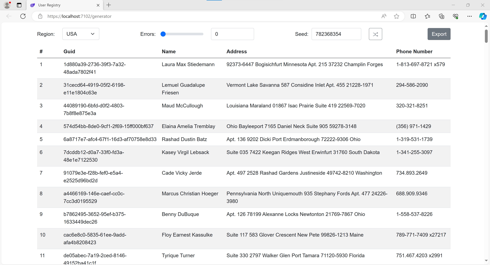

# User Registry

  

User Registry Web App provides fake user data generation on the fly.\
User can control error count, seed value (used for data generation), and region.\
In addition to that user can download result stored in .csv file. 

The app is build with Blazor and uses WebAssembly to run the data generation.

The data generates in deterministic manner. Combination of seed, region and error count values drives the generator.\
Therefore as long as the values provided remain the same so does the result.

>Check out the <a href=""><u><i>Demo Video</a>!</i></u>

---

>You can play with the deployed test version on:\
<a href="https://task-5-user-registry.azurewebsites.net/">
<u><i>task-5-user-registry.azurewebsites.net/</i></u>
</a>

---

  
<i>UI Screenshots</i>

